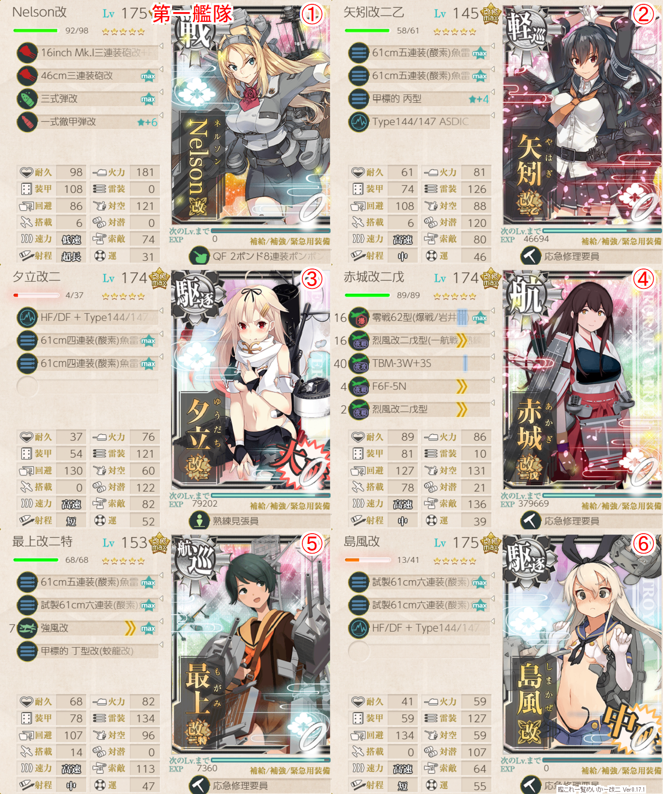

# E1

## 海域地圖

## 海域黑板

## 海域基本信息

### 貼條

無

### 血量

| 甲難度  | 血條 | Boss             | 血量 | 至少S次數 |
| ------- | ---- | ---------------- | ---- | --------- |
| P1（N） | 300  | 戦艦ル級flagship | 88   | 4         |
| P2（R） | 2800 | 護衛独還姫\[乙]  | 570  | 5         |

### 獎勵

| 難度  | 獎勵                                                                                                                                                              |
| :---: | ----------------------------------------------------------------------------------------------------------------------------------------------------------------- |
|  甲   | <ul><li>北方迷彩(+北方装备)⭐+6 x1</li><li>特大发11联队⭐+2 x1</li><li>Hedgehog(初期型)⭐+2 x1</li><li>應急修復女神 x2</li><li>改修資材 x6</li><li>勋章 x1</li></ul> |
|  乙   | <ul><li>北方迷彩(+北方装备)⭐+3 x1</li><li>Hedgehog(初期型) x1</li><li>應急修復女神 x2</li><li>改修資材 x4</li><li>勋章 x1</li></ul>                               |
|  丙   | <ul><li>北方迷彩(+北方装备) x1</li><li>三式暴雷投射机集中配备 x1</li><li>應急修復女神 x1</li><li>改修資材 x2</li><li>勋章 x1</li></ul>                            |
|  丁   | <ul><li>三式暴雷投射机⭐+4 x1</li><li>應急修復女神 x1</li><li>勋章 x1</li></ul>                                                                                    |

## 帶路條件

| 節點  | 規則                                                                                                                                                                                                          |
| :---: | ------------------------------------------------------------------------------------------------------------------------------------------------------------------------------------------------------------- |
|   C   | <ul><li>[高速+] →F</li><li>CV(L)≥3 →E</li><li>DD+DE≥3 →F</li><li>DD=2 and 高速 →F</li><li>else →E</li></ul>                                                                                                   |
|   E   | <ul><li>經過A→B的艦隊 →F</li><li>
CL≥1
<ul><li>DD+DE≥2 →G</li><li>[高速] →G</li><li>else →F</li></ul></li><li>
CL=0
<ul><li>BB(V)+CV(L)≥3 →F</li><li>DD+DE≥3 →G</li><li>else →F</li></ul></li></ul> |
|   F   | <ul><li>[高速+] →I</li><li>BB(V)+CV(L)≥4 →H</li><li>BB(V)+CV(B)≥3 →H</li><li>CV(L)≥3 →H</li><li>else →I</li></ul>                                                                                             |
|   I   | <ul><li>分歧係數4？索敵≥60 →N</li><li>索敵不足 →K</li></ul>                                                                                                                                                   |
|   L   | <ul><li>CV(L)≥3 →O</li><li>DD≤1 →O</li><li>else →P</li></ul>                                                                                                                                                  |
|   p   | <ul><li>分歧係數4？索敵≥60 →R</li><li>索敵不足 →Q</li></ul>                                                                                                                                                   |

## 特效和倍卡

### 艦娘倍卡

| E1                                                         | 倍率 | 艦種  |
| ---------------------------------------------------------- | ---- | ----- |
| Гангут                                                     | 1.1x | BB    |
| 足柄, 那智                                                 | 1.1x | CA    |
| 阿武隈, 多摩, 木曾                                         | 1.1x | CL(T) |
| 曙, 潮, 霞,  初霜, 不知火, 若葉, 初春, 響, Верный, Ташкент | 1.1x | DD    |
| 海防艦                                                     | 1.1x | DE    |

| E1-1                                  | 倍率  | 艦種  |
| ------------------------------------- | ----- | ----- |
| 海防艦                                | 1.1x  | DE    |
| Гангут                                | 1.1x  | BB    |
| 響, Верный, Ташкент                   | 1.1x  | DD    |
| 足柄, 那智                            | 1.26x | CA    |
| 阿武隈, 多摩, 木曾                    | 1.26x | CL(T) |
| 曙, 潮, 霞,  初霜, 不知火, 若葉, 初春 | 1.26x | DD    |

| E1-2 (J, M, P, R)                                                | 倍率  | 艦種  |
| ---------------------------------------------------------------- | ----- | ----- |
| 海防艦                                                           | 1.26x | DE    |
| Гангут                                                           | 1.26x | BB    |
| 足柄, 那智                                                       | 1.26x | CA    |
| 阿武隈, 多摩, 木曾                                               | 1.26x | CL(T) |
| 曙, 潮, 霞,  初霜, 不知火, 若葉, 初春(?), 響(?), Верный, Ташкент | 1.26x | DD    |

| 護衛独還姫       | 倍率  | 艦種  |
| ---------------- | ----- | ----- |
| 金剛型           | 1.15x | BB    |
| 赤城, 翔鶴, 瑞鶴 | 1.2x  | CV(B) |

### 裝備特效

| E1                   | 效果                  | 可搭載艦種                                   |
| -------------------- | --------------------- | -------------------------------------------- |
| 北方迷彩(＋北方装備) | 裝甲+3，cap后回避上升 | (F)BB(V),CV(B/L),CA(V),CL,DD,AV,AO,AS,LHA,AR |

| 護衛独還姫    | 倍率  | 可搭載艦種                      |
| ------------- | ----- | ------------------------------- |
| 三式弾        | 1.38x | (F)BB(V),CA(V)                  |
| 水戦/水爆 x1  | 1.3x  | BB(V),CA(V),CL,AV,AO,SSV,AS,LHA |
| 水戦/水爆 x2+ | 1.45x | BB(V),CA(V),CL,AV,AO,SSV,AS,LHA |
| 艦爆 x1       | 1.4x  | CV(B/L),BBV                     |
| 艦爆 x2+      | 2.25x | CV(B/L),BBV                     |


對Boss特效打空依然有效。



詳細搭載情況可查詢 [WhoCallsTheFleet-Yuubari](https://yuubari.fleet.moe)


## 敵方編成

* [wikiwiki](https://wikiwiki.jp/kancolle/%E5%B8%B0%E3%81%A3%E3%81%A6%E3%81%8D%E3%81%9F%E9%8E%AE%E5%AE%88%E5%BA%9C%E7%A7%8B%E5%88%80%E9%AD%9A%E7%A5%AD%E3%82%8A/E1#fleet)
* [kancolle wiki](https://en.kancollewiki.net/Fall_2021_Event/Main_Operation#E-1)
* [制空模擬](https://noro6.github.io/kcTools/simulator/)

## 攻略流程

1. E1-1 血條（N點boss）
2. E1-2 開路解密（可在E1-1階段完成）
     * M點 A勝利
3. E1-2 血條（R點boss）

## E1-1 攻略指南

### 高速+ 下路

#### 路綫信息

| E1-1 | [高速+]路綫信息                                 |
| ---- | ----------------------------------------------- |
| 路綫 | 1→A→B→C→F→I→N                                   |
| 陣型 | A(能動)→B(輪形)→C(單縱)→F(單橫)→I(單縱)→N(單縱) |
| 敵陣 | 空襲→水雷→3SS→2CVL→3BB                          |
| 規則 | [高速+] 艦隊                                    |
| 陣容 | 4CV1BB1CLT[高速+],4CV2BB[高速+]等               |
| 制空 | B=I(確保:462,優勢:231)                          |
| 索敵 | 係數4？索敵≥60                                  |
| 難度 | 低                                              |

#### 艦隊示例

* 可以使用CLT，日向改二，加賀改二護輔助反潛。
* 注意能動選B點。
* 全員打孔下可選。

#### 艦隊模擬



[點擊跳轉](https://aircalc.page.link/QgQS)


[點擊跳轉](https://jervis.page.link/1vGv)


[點擊跳轉](http://kancolle-calc.net/deckbuilder.html?predeck={%22version%22:4,%22hqlv%22:120,%22f1%22:{%22s1%22:{%22id%22:%22646%22,%22lv%22:139,%22luck%22:24,%22items%22:{%22i1%22:{%22id%22:144,%22rf%22:0,%22mas%22:7},%22i2%22:{%22id%22:244,%22rf%22:0,%22mas%22:0},%22i3%22:{%22id%22:100,%22rf%22:0,%22mas%22:7},%22i4%22:{%22id%22:336,%22rf%22:0,%22mas%22:7},%22i5%22:{%22id%22:87,%22rf%22:0,%22mas%22:0},%22ix%22:{%22id%22:33,%22rf%22:0,%22mas%22:0}}},%22s2%22:{%22id%22:%22599%22,%22lv%22:174,%22luck%22:39,%22items%22:{%22i1%22:{%22id%22:144,%22rf%22:0,%22mas%22:7},%22i2%22:{%22id%22:94,%22rf%22:0,%22mas%22:7},%22i3%22:{%22id%22:100,%22rf%22:0,%22mas%22:7},%22i4%22:{%22id%22:437,%22rf%22:0,%22mas%22:7},%22i5%22:{%22id%22:87,%22rf%22:0,%22mas%22:7},%22ix%22:{%22id%22:33,%22rf%22:0,%22mas%22:7}}},%22s3%22:{%22id%22:%22554%22,%22lv%22:140,%22luck%22:46,%22items%22:{%22i1%22:{%22id%22:327,%22rf%22:0,%22mas%22:7},%22i2%22:{%22id%22:212,%22rf%22:0,%22mas%22:7},%22i3%22:{%22id%22:157,%22rf%22:10,%22mas%22:7},%22i4%22:{%22id%22:87,%22rf%22:0,%22mas%22:7},%22i5%22:{%22id%22:87,%22rf%22:0,%22mas%22:7},%22ix%22:{%22id%22:33,%22rf%22:0,%22mas%22:7}}},%22s4%22:{%22id%22:%22119%22,%22lv%22:174,%22luck%22:50,%22items%22:{%22i1%22:{%22id%22:262,%22rf%22:0,%22mas%22:7},%22i2%22:{%22id%22:364,%22rf%22:0,%22mas%22:0},%22i3%22:{%22id%22:87,%22rf%22:0,%22mas%22:7},%22i4%22:null,%22i5%22:null,%22ix%22:{%22id%22:33,%22rf%22:0,%22mas%22:7}}},%22s5%22:{%22id%22:%22466%22,%22lv%22:174,%22luck%22:24,%22items%22:{%22i1%22:{%22id%22:100,%22rf%22:0,%22mas%22:7},%22i2%22:{%22id%22:144,%22rf%22:0,%22mas%22:7},%22i3%22:{%22id%22:94,%22rf%22:0,%22mas%22:0},%22i4%22:{%22id%22:87,%22rf%22:0,%22mas%22:7},%22i5%22:null,%22ix%22:{%22id%22:33,%22rf%22:0,%22mas%22:7}}},%22s6%22:{%22id%22:%22467%22,%22lv%22:174,%22luck%22:56,%22items%22:{%22i1%22:{%22id%22:154,%22rf%22:0,%22mas%22:7},%22i2%22:{%22id%22:144,%22rf%22:0,%22mas%22:7},%22i3%22:{%22id%22:94,%22rf%22:0,%22mas%22:0},%22i4%22:{%22id%22:87,%22rf%22:0,%22mas%22:7},%22i5%22:null,%22ix%22:{%22id%22:33,%22rf%22:0,%22mas%22:7}}}},%22f2%22:{},%22f3%22:{},%22a1%22:{%22mode%22:0,%22items%22:{}},%22a2%22:{%22mode%22:0,%22items%22:{}},%22a3%22:{%22mode%22:0,%22items%22:{}}})


[暫不可用](https://fleet.diablohu.com/)




#### 配裝代碼





<pre><code>(1)加賀改二護 Lv139　村田天山>>,Swordfish Mk.III(熟練)>>,江草彗星>>,烈風改二>>,新型高温高圧缶,改良型艦本式タービン
(2)赤城改二戊 Lv174　村田天山>>,友永天山>>,江草彗星>>,試製 陣風>>,新型高温高圧缶>>,改良型艦本式タービン>>
(3)日向改二 Lv140　S-51J改>>,彩雲(東カロリン空)>>,零戦虎徹>>★10,新型高温高圧缶>>,新型高温高圧缶>>,改良型艦本式タービン>>
(4)北上改二 Lv174　HF/DF + Type144/147 ASDIC>>,甲標的 丁型改(蛟龍改),新型高温高圧缶>>,改良型艦本式タービン>>
(5)翔鶴改二甲 Lv174　江草彗星>>,村田天山>>,友永天山>>,新型高温高圧缶>>,改良型艦本式タービン>>
(6)瑞鶴改二甲 Lv174　岩井爆戦>>,村田天山>>,友永天山>>,新型高温高圧缶>>,改良型艦本式タービン>>
</code></pre>




<pre><code>{"version":4,"hqlv":120,"f1":{"s1":{"id":"646","lv":139,"luck":24,"items":{"i1":{"id":144,"rf":0,"mas":7},"i2":{"id":244,"rf":0,"mas":0},"i3":{"id":100,"rf":0,"mas":7},"i4":{"id":336,"rf":0,"mas":7},"i5":{"id":87,"rf":0,"mas":0},"ix":{"id":33,"rf":0,"mas":0}}},"s2":{"id":"599","lv":174,"luck":39,"items":{"i1":{"id":144,"rf":0,"mas":7},"i2":{"id":94,"rf":0,"mas":7},"i3":{"id":100,"rf":0,"mas":7},"i4":{"id":437,"rf":0,"mas":7},"i5":{"id":87,"rf":0,"mas":7},"ix":{"id":33,"rf":0,"mas":7}}},"s3":{"id":"554","lv":140,"luck":46,"items":{"i1":{"id":327,"rf":0,"mas":7},"i2":{"id":212,"rf":0,"mas":7},"i3":{"id":157,"rf":10,"mas":7},"i4":{"id":87,"rf":0,"mas":7},"i5":{"id":87,"rf":0,"mas":7},"ix":{"id":33,"rf":0,"mas":7}}},"s4":{"id":"119","lv":174,"luck":50,"items":{"i1":{"id":262,"rf":0,"mas":7},"i2":{"id":364,"rf":0,"mas":0},"i3":{"id":87,"rf":0,"mas":7},"i4":null,"i5":null,"ix":{"id":33,"rf":0,"mas":7}}},"s5":{"id":"466","lv":174,"luck":24,"items":{"i1":{"id":100,"rf":0,"mas":7},"i2":{"id":144,"rf":0,"mas":7},"i3":{"id":94,"rf":0,"mas":0},"i4":{"id":87,"rf":0,"mas":7},"i5":null,"ix":{"id":33,"rf":0,"mas":7}}},"s6":{"id":"467","lv":174,"luck":56,"items":{"i1":{"id":154,"rf":0,"mas":7},"i2":{"id":144,"rf":0,"mas":7},"i3":{"id":94,"rf":0,"mas":0},"i4":{"id":87,"rf":0,"mas":7},"i5":null,"ix":{"id":33,"rf":0,"mas":7}}}},"f2":{},"f3":{},"a1":{"mode":0,"items":{}},"a2":{"mode":0,"items":{}},"a3":{"mode":0,"items":{}}}
</code></pre>




<pre><code>{"version":4,"hqlv":120,"f1":{"s1":{"id":646,"lv":139,"hp":92,"luck":24,"asw":88,"items":{"i1":{"id":144,"rf":0,"mas":7},"i2":{"id":244,"rf":0,"mas":0},"i3":{"id":100,"rf":0,"mas":7},"i4":{"id":336,"rf":0,"mas":7},"i5":{"id":87,"rf":0,"mas":0},"ix":{"id":33,"rf":0,"mas":0}}},"s2":{"id":599,"lv":174,"hp":89,"luck":39,"asw":0,"items":{"i1":{"id":144,"rf":0,"mas":7},"i2":{"id":94,"rf":0,"mas":7},"i3":{"id":100,"rf":0,"mas":7},"i4":{"id":437,"rf":0,"mas":7},"i5":{"id":87,"rf":0,"mas":7},"ix":{"id":33,"rf":0,"mas":7}}},"s3":{"id":554,"lv":140,"hp":86,"luck":46,"asw":92,"items":{"i1":{"id":327,"rf":0,"mas":7},"i2":{"id":212,"rf":0,"mas":7},"i3":{"id":157,"rf":10,"mas":7},"i4":{"id":87,"rf":0,"mas":7},"i5":{"id":87,"rf":0,"mas":7},"ix":{"id":33,"rf":0,"mas":7}}},"s4":{"id":119,"lv":174,"hp":49,"luck":50,"asw":118,"items":{"i1":{"id":262,"rf":0,"mas":7},"i2":{"id":364,"rf":0,"mas":0},"i3":{"id":87,"rf":0,"mas":7},"ix":{"id":33,"rf":0,"mas":7}}},"s5":{"id":466,"lv":174,"hp":86,"luck":24,"asw":0,"items":{"i1":{"id":100,"rf":0,"mas":7},"i2":{"id":144,"rf":0,"mas":7},"i3":{"id":94,"rf":0,"mas":0},"i4":{"id":87,"rf":0,"mas":7},"ix":{"id":33,"rf":0,"mas":7}}},"s6":{"id":467,"lv":174,"hp":87,"luck":56,"asw":0,"items":{"i1":{"id":154,"rf":0,"mas":7},"i2":{"id":144,"rf":0,"mas":7},"i3":{"id":94,"rf":0,"mas":0},"i4":{"id":87,"rf":0,"mas":7},"ix":{"id":33,"rf":0,"mas":7}}}},"f2":{},"f3":{},"f4":{},"a1":{"mode":1,"items":{}},"a2":{"mode":1,"items":{}},"a3":{"mode":1,"items":{}}}
</code></pre>





### 低速 上路

#### 路綫信息

| E1-1 | 普通路綫信息                                    |
| ---- | ----------------------------------------------- |
| 路綫 | 1→A→D→E→F→I→N                                   |
| 陣型 | A(能動)→D(單橫)→E(警戒)→F(單橫)→I(警戒)→N(單縱) |
| 敵陣 | 3SS→水雷→3SS→2CVL→3BB                           |
| 規則 | BB+CV(B)≤2,CVL≤1,CV(B/L)≤2,CL≥1,DD+DE≤2,[低速]  |
| 陣容 | 1BB1CV1CVL1CL2CLT,1BB1CV1CVL11CL1CLT1CAV等      |
| 制空 | I(確保:462,優勢:231)                            |
| 索敵 | 係數4？索敵≥60                                  |
| 難度 | 低                                              |

#### 艦隊示例

* 可以使用CLT，日向改二，加賀改二護輔助反潛。
* 可以使用CLT，最上改二特，矢矧改二乙，夕張改二特等輔助開幕。
* 需要低速艦隊，一般使用低速BB。
* 注意能動選D點。
* 孔裏可以使用北方迷彩(＋北方装備)。

#### 艦隊模擬



[點擊跳轉](https://aircalc.page.link/YzqA)


[點擊跳轉](https://jervis.page.link/rPhr)


[點擊跳轉](http://kancolle-calc.net/deckbuilder.html?predeck={%22version%22:4,%22hqlv%22:120,%22f1%22:{%22s1%22:{%22id%22:%22668%22,%22lv%22:146,%22luck%22:46,%22items%22:{%22i1%22:{%22id%22:179,%22rf%22:0,%22mas%22:0},%22i2%22:{%22id%22:309,%22rf%22:0,%22mas%22:7},%22i3%22:{%22id%22:179,%22rf%22:0,%22mas%22:0},%22i4%22:{%22id%22:262,%22rf%22:0,%22mas%22:0},%22i5%22:null,%22ix%22:{%22id%22:129,%22rf%22:0,%22mas%22:0}}},%22s2%22:{%22id%22:%22599%22,%22lv%22:174,%22luck%22:39,%22items%22:{%22i1%22:{%22id%22:144,%22rf%22:0,%22mas%22:7},%22i2%22:{%22id%22:144,%22rf%22:0,%22mas%22:7},%22i3%22:{%22id%22:100,%22rf%22:0,%22mas%22:7},%22i4%22:{%22id%22:336,%22rf%22:0,%22mas%22:7},%22i5%22:{%22id%22:375,%22rf%22:0,%22mas%22:7},%22ix%22:{%22id%22:274,%22rf%22:0,%22mas%22:0}}},%22s3%22:{%22id%22:%22560%22,%22lv%22:170,%22luck%22:46,%22items%22:{%22i1%22:{%22id%22:100,%22rf%22:0,%22mas%22:7},%22i2%22:{%22id%22:144,%22rf%22:0,%22mas%22:7},%22i3%22:{%22id%22:94,%22rf%22:0,%22mas%22:7},%22i4%22:{%22id%22:437,%22rf%22:0,%22mas%22:7},%22i5%22:null,%22ix%22:{%22id%22:274,%22rf%22:0,%22mas%22:0}}},%22s4%22:{%22id%22:%22553%22,%22lv%22:173,%22luck%22:43,%22items%22:{%22i1%22:{%22id%22:183,%22rf%22:10,%22mas%22:0},%22i2%22:{%22id%22:390,%22rf%22:10,%22mas%22:0},%22i3%22:{%22id%22:157,%22rf%22:10,%22mas%22:7},%22i4%22:{%22id%22:323,%22rf%22:0,%22mas%22:7},%22i5%22:{%22id%22:365,%22rf%22:6,%22mas%22:0},%22ix%22:{%22id%22:129,%22rf%22:0,%22mas%22:0}}},%22s5%22:{%22id%22:%22119%22,%22lv%22:174,%22luck%22:50,%22items%22:{%22i1%22:{%22id%22:262,%22rf%22:0,%22mas%22:7},%22i2%22:{%22id%22:364,%22rf%22:0,%22mas%22:7},%22i3%22:{%22id%22:261,%22rf%22:0,%22mas%22:0},%22i4%22:null,%22i5%22:null,%22ix%22:{%22id%22:129,%22rf%22:0,%22mas%22:0}}},%22s6%22:{%22id%22:%22118%22,%22lv%22:169,%22luck%22:48,%22items%22:{%22i1%22:{%22id%22:262,%22rf%22:0,%22mas%22:7},%22i2%22:{%22id%22:309,%22rf%22:4,%22mas%22:7},%22i3%22:{%22id%22:261,%22rf%22:0,%22mas%22:0},%22i4%22:null,%22i5%22:null,%22ix%22:{%22id%22:129,%22rf%22:0,%22mas%22:0}}}},%22f2%22:{},%22f3%22:{},%22a1%22:{%22mode%22:0,%22items%22:{}},%22a2%22:{%22mode%22:0,%22items%22:{}},%22a3%22:{%22mode%22:0,%22items%22:{}}})


[點擊跳轉](https://fleet.diablohu.com/)




#### 配裝代碼





<pre><code>(1)矢矧改二乙 Lv146　試製61cm六連装(酸素)魚雷,甲標的 丙型>>,試製61cm六連装(酸素)魚雷,HF/DF + Type144/147 ASDIC,熟練見張員
(2)赤城改二戊 Lv174　村田天山>>,村田天山>>,江草彗星>>,烈風改二>>,XF5U>>,12cm30連装噴進砲改二
(3)瑞鳳改二乙 Lv170　江草彗星>>,村田天山>>,友永天山>>,試製 陣風>>,12cm30連装噴進砲改二
(4)伊勢改二 Lv173　16inch三連装砲 Mk.7+GFCS★10,16inch三連装砲 Mk.6+GFCS★10,零戦虎徹>>★10,瑞雲改二(六三四空/熟練)>>,一式徹甲弾改★6,熟練見張員
(5)北上改二 Lv174　HF/DF + Type144/147 ASDIC>>,甲標的 丁型改(蛟龍改)>>,Type144/147 ASDIC,熟練見張員
(6)大井改二 Lv169　HF/DF + Type144/147 ASDIC>>,甲標的 丙型>>★4,Type144/147 ASDIC,熟練見張員
</code></pre>




<pre><code>{"version":4,"hqlv":120,"f1":{"s1":{"id":"668","lv":146,"luck":46,"items":{"i1":{"id":179,"rf":0,"mas":0},"i2":{"id":309,"rf":0,"mas":7},"i3":{"id":179,"rf":0,"mas":0},"i4":{"id":262,"rf":0,"mas":0},"i5":null,"ix":{"id":129,"rf":0,"mas":0}}},"s2":{"id":"599","lv":174,"luck":39,"items":{"i1":{"id":144,"rf":0,"mas":7},"i2":{"id":144,"rf":0,"mas":7},"i3":{"id":100,"rf":0,"mas":7},"i4":{"id":336,"rf":0,"mas":7},"i5":{"id":375,"rf":0,"mas":7},"ix":{"id":274,"rf":0,"mas":0}}},"s3":{"id":"560","lv":170,"luck":46,"items":{"i1":{"id":100,"rf":0,"mas":7},"i2":{"id":144,"rf":0,"mas":7},"i3":{"id":94,"rf":0,"mas":7},"i4":{"id":437,"rf":0,"mas":7},"i5":null,"ix":{"id":274,"rf":0,"mas":0}}},"s4":{"id":"553","lv":173,"luck":43,"items":{"i1":{"id":183,"rf":10,"mas":0},"i2":{"id":390,"rf":10,"mas":0},"i3":{"id":157,"rf":10,"mas":7},"i4":{"id":323,"rf":0,"mas":7},"i5":{"id":365,"rf":6,"mas":0},"ix":{"id":129,"rf":0,"mas":0}}},"s5":{"id":"119","lv":174,"luck":50,"items":{"i1":{"id":262,"rf":0,"mas":7},"i2":{"id":364,"rf":0,"mas":7},"i3":{"id":261,"rf":0,"mas":0},"i4":null,"i5":null,"ix":{"id":129,"rf":0,"mas":0}}},"s6":{"id":"118","lv":169,"luck":48,"items":{"i1":{"id":262,"rf":0,"mas":7},"i2":{"id":309,"rf":4,"mas":7},"i3":{"id":261,"rf":0,"mas":0},"i4":null,"i5":null,"ix":{"id":129,"rf":0,"mas":0}}}},"f2":{},"f3":{},"a1":{"mode":0,"items":{}},"a2":{"mode":0,"items":{}},"a3":{"mode":0,"items":{}}}
</code></pre>




<pre><code>{"version":4,"f1":{"s1":{"id":668,"lv":146,"luck":46,"items":{"i1":{"id":179,"rf":0,"mas":0},"i2":{"id":309,"rf":0,"mas":0},"i3":{"id":179,"rf":0,"mas":0},"i4":{"id":262,"rf":0,"mas":0},"ix":{"id":129,"rf":0,"mas":0}}},"s2":{"id":599,"lv":174,"luck":39,"items":{"i1":{"id":144,"rf":0,"mas":7},"i2":{"id":144,"rf":0,"mas":7},"i3":{"id":100,"rf":0,"mas":7},"i4":{"id":336,"rf":0,"mas":7},"ix":{"id":274,"rf":0,"mas":0},"i5":{"id":375,"rf":0,"mas":7}}},"s3":{"id":560,"lv":170,"luck":46,"items":{"i1":{"id":100,"rf":0,"mas":7},"i2":{"id":144,"rf":0,"mas":7},"i3":{"id":94,"rf":0,"mas":7},"i4":{"id":437,"rf":0,"mas":7},"ix":{"id":274,"rf":0,"mas":0}}},"s4":{"id":553,"lv":173,"luck":43,"items":{"i1":{"id":183,"rf":10,"mas":0},"i2":{"id":390,"rf":10,"mas":0},"i3":{"id":157,"rf":10,"mas":7},"i4":{"id":323,"rf":0,"mas":7},"ix":{"id":129,"rf":0,"mas":0},"i5":{"id":365,"rf":6,"mas":0}}},"s5":{"id":119,"lv":174,"luck":50,"items":{"i1":{"id":262,"rf":0,"mas":0},"i2":{"id":364,"rf":0,"mas":0},"i3":{"id":261,"rf":0,"mas":0},"i4":{"id":129,"rf":0,"mas":0}}},"s6":{"id":118,"lv":169,"luck":48,"items":{"i1":{"id":262,"rf":0,"mas":0},"i2":{"id":309,"rf":4,"mas":0},"i3":{"id":261,"rf":0,"mas":0},"i4":{"id":129,"rf":0,"mas":0}}}},"f2":{},"f3":{},"f4":{},"fField":{}}
</code></pre>





## E1-2 開路解密

### M點 A勝利 
同E1-2配置，能動選J點即可。

## E1-2 攻略指南

### 2CV 上路

#### 路綫信息

| E1-2 | 2CV 路綫信息                                            |
| ---- | ------------------------------------------------------- |
| 路綫 | 1→A→D→E→G→L→P→R                                         |
| 陣型 | A(能動)→D(單橫)→E(警戒)→G(能動)→L(輪形)→P(警戒)→R(單縱) |
| 敵陣 | 3SS→水雷→Boss空襲→2CA→Boss                              |
| 規則 | CV(B/L),CL≥1,DD+DE≥2                                    |
| 陣容 | 1BB2CV1CL2DD(推薦),1BB1CV1CAV1CL2DD等                   |
| 制空 | R(磨血優勢:557,斬殺優勢:516)                            |
| 索敵 | 係數4？索敵≥60                                          |
| 難度 | 低                                                      |

#### 艦隊示例

* Boss點複縱陣。
* 最上可以換CV，然後讓出5號位換炮擊艦。
* 也可直接使用打撈配置推圖。

#### 艦隊模擬



[點擊跳轉](https://noro6.github.io/kcTools/)


[點擊跳轉](https://noro6.github.io/kcTools/)


[點擊跳轉](https://noro6.github.io/kcTools/)


[點擊跳轉](https://noro6.github.io/kcTools/)




#### 配裝代碼




<pre><code>{"version":4,"hqlv":120,"f1":{"s1":{"id":610,"lv":99,"hp":84,"luck":1}
</code></pre>




<pre><code>This is a code block.
</code></pre>





## 周回

### [掉落信息](https://tsunkit.net/nav/#/52-1?start=2021-09-30)

| 節點         | 掉落                                                  |
| ------------ | ----------------------------------------------------- |
| N(E1-1 Boss) | 狭雾,神威,瑞穗                                        |
| R(E1-2 Boss) | 宗谷,择捉,薄云,长鲸,春日丸,神鹰,马路油,亲潮,占守,国后 |
| P            | 瑞穗,天雾,薄云,神威                                   |
| M            | 福江                                                  |

* まるゆ R點掉率2.2%，且A勝也會掉落。

### E1-2 打撈配置

* [制空模擬](https://aircalc.page.link/LH6S)
* 飛機差的話可以CL加1水戰維持制空。
* 如果20條之後掉率明顯下降，可以調整配裝，換用不同種類加成裝備。
* 用同一套配置完成33條已經被測試是可行的，而且我在幾個小時内完成。完全不需要其他地圖。


[2021-mackerel-pike-fishing.md](../2021-mackerel-pike-fishing.md)


## 建議

* [x] 斬殺
* [x] 撈🐟x33
* [x] 周回まるゆ

## 參考鏈接

>https://tsunkit.net/nav/#/
>
>https://bbs.nga.cn/read.php?tid=29173511
>
>https://bbs.nga.cn/read.php?tid=29198102
>
>https://twitter.com/dewydrops/status/1454638627011457025
>