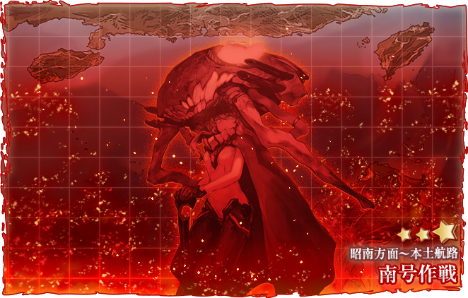
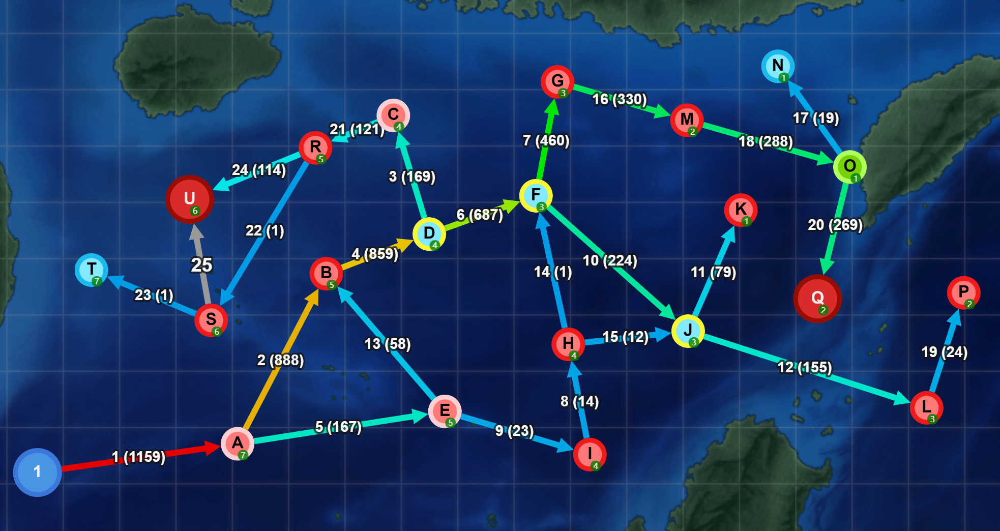

# E2

## 海域地圖

## 海域黑板

## 海域基本信息

### 貼條

ヒ船団

### 血量

#### E2-1




| 甲難度 | 輸送TP |
| ------ | ------ |
| P1(Q)  | 650    |



| 乙難度 | 輸送TP |
| ------ | ------ |
| P1(Q)  |     |




| 丙難度 | 輸送TP |
| ------ | ------ |
| P1(Q)  |    |




| 丁難度 | 輸送TP |
| ------ | ------ |
| P1(Q)  |   |




#### E2-2



| 甲難度 | 血條 | Boss                           | 血量 | 至少S次數 |
| ------ | ---- | ------------------------------ | ---- | --------- |
| P1(Q)  |      | 軽母ヌ級改flagship(艦載機鳥赤) |      |           |
| P2(U)  |      | 空母ヲ級改flagship(艦載機赤)   |      |           |




### 獎勵




* 21inch艦首魚雷発射管6門(初期型)⭐+4 x1
* 潜水艦後部魚雷発射管4門(初期型)⭐+4 x1
* 試製15cm9連装対潜噴進砲⭐+2 x1
* HF／DF ＋Type144／147 ASDIC⭐+2 x1
* 改修資材 x7
* 補強増設 x1



* 21inch艦首魚雷発射管6門(初期型)⭐+2 x1
* 潜水艦後部魚雷発射管4門(初期型)⭐+2 x1
* Type144／147 ASDIC⭐+2 x1
* 改修資材 x5
* 補強増設 x1



* 21inch艦首魚雷発射管6門(初期型) x1
* 潜水艦後部魚雷発射管4門(初期型) x1
* Type124 ASDIC⭐+2 x1
* 改修資材 x5



* 九三式水中聴音機⭐+4 x1
* 三式水中探信儀⭐+4 x1




## 帶路條件                                                                     

## 特效和倍卡

### 艦娘倍卡

### 裝備特效


詳細搭載情況可查詢 [WhoCallsTheFleet-Yuubari](https://yuubari.fleet.moe)


## 敵方編成

* [KCNav](https://tsunkit.net/nav/#/52-2?start=2021-11-18)
* [wikiwiki](https://wikiwiki.jp/kancolle/%E5%B8%B0%E3%81%A3%E3%81%A6%E3%81%8D%E3%81%9F%E9%8E%AE%E5%AE%88%E5%BA%9C%E7%A7%8B%E5%88%80%E9%AD%9A%E7%A5%AD%E3%82%8A/E2#fleet)
* [kancolle wiki](https://en.kancollewiki.net/Fall\_2021\_Event/Main\_Operation#E-2)
* [制空模擬](https://noro6.github.io/kcTools/simulator/)

## 攻略流程

1. E2-1 開路解密
   * G點 A勝利 x1
   * K點 A勝利 x1
   * L點 A勝利 x2
2. E2-1 綠條（Q點boss）
3. E2-2 開路解密（可在E2-1 綠條過程完成）
   * E2-1 綠條結束
   * C點 航空優勢 x1
   * P點 A勝利 x1
   * 防空優勢 x1
4. E2-2 血條（R點boss）

## E2-1 開路解密

GKL三點全是能動。GK辛棄疾，L水面。

ABDF（G/K/L)

1CVL1CL4DD 5先反 或 CL5DD司令部

制空72劣勢，143均勢。

陸航一隊防空，二隊04東海或04陸攻。

道中反潛支援。

如果L點打不過，2CV1CVL3DD，AEIJL

## E2-1 攻略指南

1CVL1AV4DD 或 1CVL1CL4DD 或 1CL5DD司令部

ABDFGMOQ

先反，大發運輸，對空CI。

制空72劣勢，143均勢。

索敵13(不用CVL的話上2飛機)

陸航一隊防空，二隊04東海。

道中反潛支援，boss炮擊。

## E2-2 開路解密

防空順便做。

C點，2CVL1AV(CL)3DD繞E。 節約一點可以1CVL1AV(CL）4DD直達。陸航40后制空300+。

L點，2CV1CVL3DD，AEIJL

## E2-2 攻略指南

1CVL1AV（CL）4DD

ABDCRU

先反，對空CI，斬殺可以加個CI。

制空95劣勢，189均勢。

索敵16（1黃或者2水偵）。

陸航一隊防空，二隊13boss。

## 建議

* [x] 斬殺

## 參考鏈接

> https://tsunkit.net/nav/#/
>
