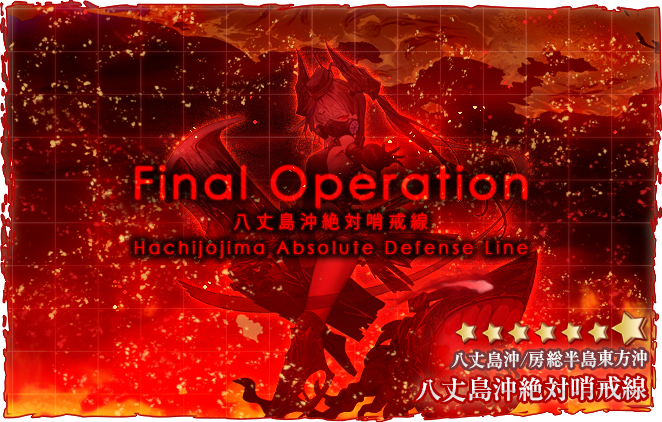
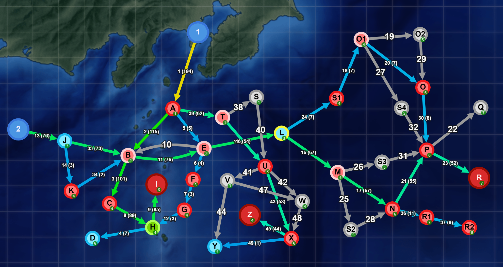
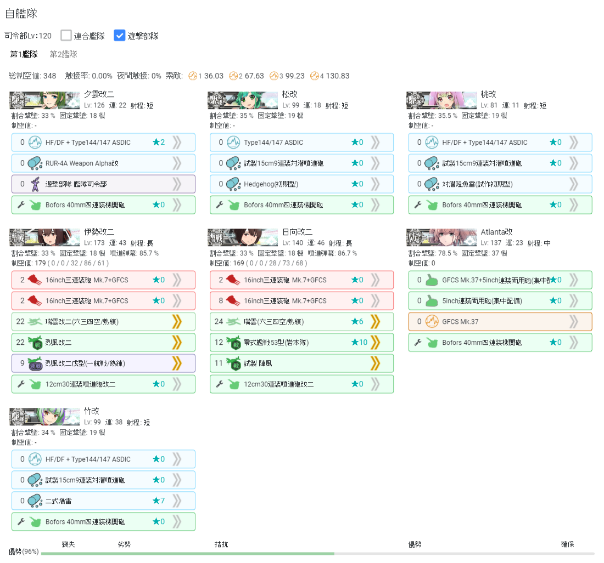
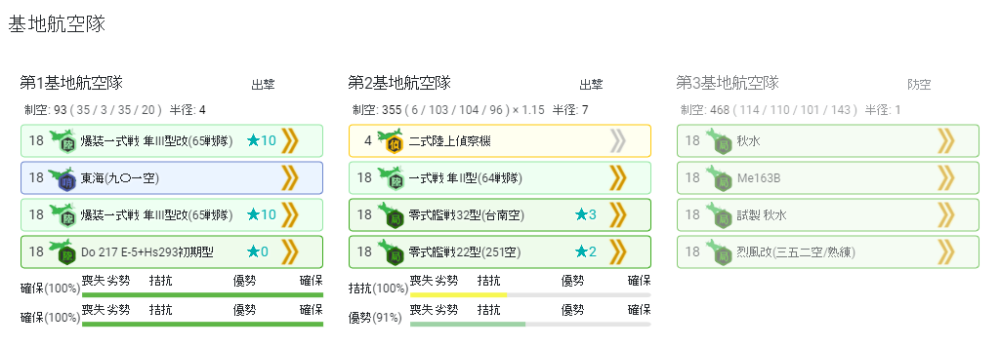

# E3

## 海域地圖

## 海域黑板

## 海域基本信息

### 貼條

E3-1 E3-3横須賀防備隊
E3-2 連合艦隊

E3-3是個反潛圖所以最多需要BBV和CL，Boss也是潛艇，所以大船都可以→聯合艦隊。

### 血量

#### E3-1




| 甲難度 | 輸送TP |
| ------ | ------ |
| P1(I)  |        |




#### E3-2

#### E3-3

### 獎勵




* 21inch艦首魚雷発射管6門(後期型)⭐+3 x1
* 潜水艦後部魚雷発射管4門(後期型)⭐+3 x1
* 徽章 x2
* 新型砲熕兵装資材 x2
* 戦闘詳報 x1
* 甲章 x1




## 帶路條件

| 分歧点 | 条件                                  |
| ------ | ------------------------------------- |
| 出发点 | [单舰队] 从1出发                      |
|        | [联合舰队] 从2出发                    |
|        |                                       |
| A      | 已开启A-T路线 且 舰队船数=7 →T        |
|        | DD+DE≤1 →B                            |
|        | (F)BB(V)+CV(B)≥3 →B                   |
|        | (F)BB(V)+CV(B/L/E)≥2 →E               |
|        | DD+DE≥5 →B                            |
|        | DD+DE=4 且 CL+CT≥1 →B                 |
|        | (F)BB(V)+CV(B)≥1 →E                   |
|        | [低速]舰队 →E                         |
|        | DD+DE=4 →B                            |
|        | CL+CT=0 →E                            |
|        | DD+DE=3 →B                            |
|        | CA系≥1 →E                             |
|        | 其余→B                                |
|        |                                       |
| B      | [联合舰队] →E                         |
|        | DD+DE≤1 →E                            |
|        | (F)BB(V)+CV(B)≥3 →E？                 |
|        | 其余→C                                |
|        |                                       |
| E      | [联合舰队] →L                         |
|        | 其余→F                                |
|        |                                       |
| H      | 分歧係數=4？甲难度索敵≥64？ →I        |
|        | 索敵不足 →D                           |
|        |                                       |
| J      | CV(B/L/E)≥4 且 [低速]舰队 →K          |
|        | 丁难度 →B                             |
|        | (F)BB(V)+CV(B)≥5 →K                   |
|        | 其余→B                                |
|        |                                       |
| M      | [输送部队] →S3                        |
|        | CL≥2 →N                               |
|        | DD≥3 →N                               |
|        | 高速舰队 →N                           |
|        | 其余→S2                               |
|        |                                       |
| N      | 未开启N-R1路线 →P                     |
|        | [水打部队] →P                         |
|        | [机动部队] →R1                        |
|        |                                       |
| O1     | (F)BB(V)+CV(B/L/E)+あきつ丸≥5 →O      |
|        | 其余→S4？                             |
|        |                                       |
| P      | 分歧係數=2？甲难度1队+2队索敵≥80？ →R |
|        | 索敵不足 →Q                           |
|        |                                       |
| T      | 舰队包含山风 →S                       |
|        | CV(B)≥1 →S                            |
|        | 其余→U                                |
|        |                                       |
| U      | DD+DE≤2 →V                            |
|        | DD+DE=3 且 [低速]舰队 →V              |
|        | 舰队包含山风 →X？                     |
|        | CV(B)≥1 →W                            |
|        | CVL≥2 →W                              |
|        | DD+DE≥5 →X                            |
|        | CL≥1 →X                               |
|        | 其余→W                                |
|        |                                       |
| V      | 索敵足够 →W                           |
|        | 索敵不足 →Y                           |
|        |                                       |
| X      | 分歧係數=4？甲难度索敵≥78？→Z         |
|        | 索敵不足 →Y                           |
|        |                                       |

## 特效和倍卡

### 艦娘倍卡

| E3 全圖          | 倍率  | 艦種 |
| ---------------- | ----- | ---- |
| 旗風，松         | 1.25x | DD   |
| 夕雲，朧，桃，竹 | 1.2x  | DD   |
| 其他驱逐舰       | 1.05x | DD   |

| E3-1/E3-3 (A,I,Z) | 倍率  | 艦種 |
| ----------------- | ----- | ---- |
| 第四号海防艦      | 1.75x | DE   |
| 旗風，松          | 1.55x | DD   |
| 夕雲，朧，桃，竹  | 1.35x | DD   |
| 其他海防舰        | 1.25x | DE   |
| 其他驱逐舰        | 1.1x  | DD   |

| E3-2 (N,P,R)                                         | 倍率 | 艦種 |
| ---------------------------------------------------- | ---- | ---- |
| 大和，長門，伊勢，日向，天城，龍鳳，利根，矢矧，北上 | 1.1x |      |
| 榛名，青葉，大淀，酒匂                               | 1.2x |      |
| 霞，雪風，Верный，朝霜，初霜，涼月，潮，磯風         | 1.2x | DD   |

| E3-3 (削甲)      | 倍率 | 艦種 |
| ---------------- | ---- | ---- |
| 第四号海防艦     | 1.2x | DE   |
| 旗風，松         | 1.2x | DD   |
| 夕雲，朧，桃，竹 | 1.2x | DD   |
| 其他船           | 1.2x |      |
| 对boss           | 1.1x |      |

* 图中为最终倍率。

## 敵方編成

* [KCNav](https://tsunkit.net/nav/#/52-3?start=2021-11-18)
* [wikiwiki](https://wikiwiki.jp/kancolle/%E5%B8%B0%E3%81%A3%E3%81%A6%E3%81%8D%E3%81%9F%E9%8E%AE%E5%AE%88%E5%BA%9C%E7%A7%8B%E5%88%80%E9%AD%9A%E7%A5%AD%E3%82%8A/E3#fleet)
* [kancolle wiki](https://en.kancollewiki.net/Fall\_2021\_Event/Main\_Operation#E-2)
* [制空模擬](https://noro6.github.io/kcTools/simulator/)

## 攻略流程

1. E3-1 綠條（I點boss）
2. E3-2 紅條（R點boss）
3. E3-3 開路解密
   * R2點 S勝利 x1
4. E3-3 紅條（Z點boss）
5. E3-3 削甲（浪費時間不用做，打完自動削）
   * boss血量≤577（进斩杀）
   * I點 A勝利 x1
   * S點 S勝利 x1
   * V點 航空優勢 x1
   * W點 S勝利 x1
   * X點 S勝利 x1

## E3-1 攻略指南

ABCHI

1AV1CL4DD 可以低速

2飛機索敵，1先反，1對空CI，可帶甲標，剩餘大發。

陸航13boss，1陸攻3東海分AC。

## E3-2 攻略指南

2BB2CV1CVL(AV)1CL 1CL1CA(V)1CLT3DD （其他配置也可）

長路一航，可以低速，boss開長路技能。制空600+。二隊CI。

JBELMNPR

陸航1313boss。

## E3-3 開路解密

3CV2CA(v)1CL 1CL1CA(V)1CLT3DD →一次R1R2即可

## E3-3 攻略指南

1BBV2CL4DD 游擊

伊勢矢矧夕張塔什甘+3dd（不要帶山風）

BBV4綠1彩雲，其他全部三件套，CL開幕。

ATUXZ

陸航4東海boss，13X。

12 15 17 暴雷投射機

18 20 暴雷

其他不變，水聼+投射機+暴雷，三件套。

## 周回

### [掉落信息](https://tsunkit.net/nav/#/52-3?start=2021-11-18)

| 節點         | 掉落                                                     |
| ------------ | -------------------------------------------------------- |
| I(E3-1 Boss) | 30号海防艦，Intrepid，桃，Fletcher，石垣，伊203，伊401   |
| R(E3-2 Boss) | 宗谷，八丈，速吸，松，まるゆ，4号海防艦，伊400，Fletcher |
| Z(E3-3 Boss) | 宗谷，Fletcher，伊400，まるゆ，竹，伊26                  |
| X            | 30号海防艦                                               |
| P            | 石垣，Intrepid，佐渡，Fletcher，30号海防艦，桃           |
| R2           | 30号海防，Fletcher，Intrepid，伊203                      |

### E2-3 打撈配置 v1

* [制空模擬](https://aircalc.page.link/qXdQ)
* 試製。
* 孔裏機槍都可以換損管。
* 陸偵第一格時放最普通的版本，避免損失熟練度。制空用不需要帶高級陸偵。
* 門神91%罰站。
* 4，5號位BBV擋槍。

## 建議

* [x] 斬殺

## 參考鏈接

> https://tsunkit.net/nav/#/
> 
> https://twitter.com/dewydrops
> 
> https://en.kancollewiki.net/Fall_2021_Event/Extra_Operation#E-3
> 
> https://bbs.nga.cn/read.php?pid=561785039&opt=128

