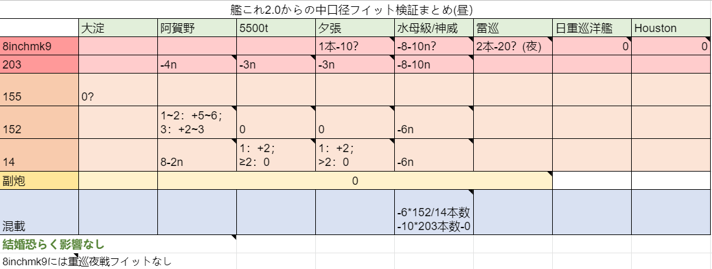

# 9-28-2021

## 艦娘改造




| 改造等級（Lv） | 83 |
| :--- | :--- |
| 改造資材 | 390彈藥，370鋼材 |
| 改造需求 | 改造設計圖\*1，戰鬥詳報\*1 |
| 特殊能力 | 内火艇 |




| 改造等級（Lv） | 91 |
| :--- | :--- |
| 改造資材 | 170彈藥，300鋼材，10開發資材，10噴火 |
| 特殊能力 | 内火艇，大發動艇系、司令部 |




推薦用改二丁，可以完整對陸攻擊。


## 新任務

### 「山風改二」、抜錨せよ！

#### 條件

* [ ] 山風改二\丁 旗艦+\(DD,DE\)\*2以上
* [ ] 1-2 S勝利
* [ ] 1-3 S勝利
* [ ] 1-4 S勝利
* [ ] 1-5 S勝利

#### 一句話配置

* 1-2 山風改二\丁 旗舰 +3DD+1CL
* 1-3 山風改二\丁 旗舰 +2DD+1CAV+2CVL
* 1-4 山風改二\丁 旗舰 +2DD+1AS+2CVL 60空確
* 1-5 山風改二\丁 旗舰 +3DD/DE

#### 獎勵

|  | 選項1 | 選項2 | 選項3 |
| :--- | :--- | :--- | :--- |
| 三選一 | 開發資材\*8 | 高速修復材\*6 | 補强增設 |
| 氪金換算 | 457日元 | 300日元 | 500日元 |

[三式水中探信儀改](https://skywalkerji.gitbook.io/kancolle/update/9-28-2021#san-shi-shui-zhong-tan-xin-yi-gai-new)

500燃料，500彈藥，500鋼材


單次且有後續任務，推薦完成。


### 改白露型駆逐艦「山風改二」、奮戦す！

#### 條件

* [ ] 山風改二/丁、江風改二、海風改二 3選2
* [ ] 2-2 S勝利
* [ ] 7-2-2 S勝利
* [ ] 5-1 S勝利
* [ ] 6-4 S勝利

#### 一句話配置

* 2-2 2DD+1AV+3CA系/CL系 81空確
* 7-2 P2 1CV+1CVL+1FBB+1CA系/CL系+2DD，高速 359空优 索敵69係數4
* 5-1 2BBV+1CA系/CL系+1CL+2DD 252空優
* 6-4 矢矧改二乙旗舰+伊势改二+最上改二特+3DD，高速 

#### 獎勵

<table>
  <thead>
    <tr>
      <th style="text-align:left"></th>
      <th style="text-align:left">&#x9078;&#x9805;1</th>
      <th style="text-align:left">&#x9078;&#x9805;2</th>
      <th style="text-align:left">&#x9078;&#x9805;3</th>
    </tr>
  </thead>
  <tbody>
    <tr>
      <td style="text-align:left">&#x4E09;&#x9078;&#x4E00;</td>
      <td style="text-align:left">
        
&#x6539;&#x4FEE;&#x8CC7;&#x6750;*5

        
&#xFF08;350&#x65E5;&#x5143;&#xFF09;

      </td>
      <td style="text-align:left">&#x5927;&#x767A;&#x52D5;&#x8247;*3</td>
      <td style="text-align:left">&#x65B0;&#x578B;&#x5175;&#x88C5;&#x8CC7;&#x6750;*2</td>
    </tr>
    <tr>
      <td style="text-align:left">&#x4E09;&#x9078;&#x4E00;</td>
      <td style="text-align:left">&#x6226;&#x95D8;&#x8A73;&#x5831;*1</td>
      <td style="text-align:left">12.7cm&#x9023;&#x88C5;&#x7832;C&#x578B;&#x6539;&#x4E8C;</td>
      <td style="text-align:left">61cm&#x56DB;&#x9023;&#x88C5;(&#x9178;&#x7D20;)&#x9B5A;&#x96F7;&#x5F8C;&#x671F;&#x578B;</td>
    </tr>
  </tbody>
</table>

880燃料，880彈藥


單次且有後續任務，可獲取四酸後期或戦闘詳報，推薦完成。


### \[鋼材輸出\]基地航空兵力を増備せよ！

#### 條件

* [ ] 拆除2艦戰
* [ ] 拆除2艦攻
* [ ] 準備24000鋼材

#### 獎勵

|  | 選項1 | 選項2 | 選項3 |
| :--- | :--- | :--- | :--- |
| 三選一 | 九六式陆攻\*2 | 一式陆攻 | 航空兵裝資材 |
| 二選一 | 新型兵装资材 | 改修資材\*3 |  |


主要獲取一式陆攻改修素材。24000鋼換一式陆攻并不完全值得。看個人改修需求。因爲是年常（9月~）任務可以觀望。


### 海上輸送航路の護衛強化

#### 條件

* [ ] 対潜警戒任務 04 \| 00:50
* [ ] 海上護衛任務 05 \| 01:30
* [x] 兵站強化任務 A1 \| 00:25
* [ ] タンカー護衛任務 09 \| 04:00
* [ ] 南西方面航空偵察作戦 B1 \| 00:35

#### 一句話攻略

* 04 1CL2DD 
* 05 1CL2DD+1自由 6閃大成功
* A1 4DD 旗艦lv128+4閃大成功
* 09 1CL2DD+1自由 6閃大成功
* B1 1CL2DD1AV+2自由 對空200 對潛200 索敵140 旗艦lv40 合計lv150 6閃大成功

#### 獎勵

<table>
  <thead>
    <tr>
      <th style="text-align:left"></th>
      <th style="text-align:left">&#x9078;&#x9805;1</th>
      <th style="text-align:left">&#x9078;&#x9805;2</th>
      <th style="text-align:left">&#x9078;&#x9805;3</th>
    </tr>
  </thead>
  <tbody>
    <tr>
      <td style="text-align:left">&#x4E09;&#x9078;&#x4E00;</td>
      <td style="text-align:left">&#x4E5D;&#x4E09;&#x5F0F;&#x6C34;&#x4E2D;&#x8ABF;&#x97F3;&#x6A5F;*2</td>
      <td
      style="text-align:left">&#x4E5D;&#x56DB;&#x5F0F;&#x7206;&#x96F7;&#x6295;&#x5C04;&#x6A5F;*2</td>
        <td
        style="text-align:left">&#x958B;&#x767A;&#x8CC7;&#x6750;*6</td>
    </tr>
    <tr>
      <td style="text-align:left">&#x4E8C;&#x9078;&#x4E00;</td>
      <td style="text-align:left">&#x4E09;&#x5F0F;&#x6C34;&#x4E2D;&#x63A2;&#x4FE1;&#x5100;*2</td>
      <td style="text-align:left">
        
&#x6539;&#x4FEE;&#x8CC7;&#x6750;*3

        
&#xFF08;210&#x65E5;&#x5143;&#xFF09;

      </td>
      <td style="text-align:left">
        
&#x7279;&#x6CE8;&#x5BB6;&#x5177;&#x8077;&#x4EBA;

        
&#xFF08;300&#x65E5;&#x5143;&#xFF09;

      </td>
    </tr>
  </tbody>
</table>

600燃料，600彈藥，600鋁


單次且有後續任務，推薦完成。


### 調整改良型'水中探信儀'の増産

#### 條件

* [ ] 旗艦：山風改二/丁or時雨改二
* [ ] 搭載：第一裝備格搭載三式水中探信儀★max
* [ ] 準備：新型兵装資材\*2, 30開発資材, 1300鋁
* [ ] 廃棄：九三式水中調音機\*2, 三式水中探信儀\*2

#### 獎勵

[三式水中探信儀改](https://skywalkerji.gitbook.io/kancolle/update/9-28-2021#san-shi-shui-zhong-tan-xin-yi-gai-new)


三式水中探信儀改為日驅頂級水聼，推薦完成后獲取。


## 新改修

### 改修表



| 基礎素材 | 改修艦 |
| :--- | :--- |
| 紫電改二 | 鈴谷航改二 |

|  | 開発資材 | 改修資材 | 消費装備 | 其他資材 |
| :--- | :--- | :--- | :--- | :--- |
| 0 ～ 5 | 5/7 | 4/5 | 紫電改二\*1 |  |
| 6 ～ 9 |  |  |  |  |
| MAX | /20 | /9 | 試製烈風 後期型\*2 | 新型航空兵資材\*1,熟練搭乘員\*1 |



| 基礎素材 | 改修艦 |
| :--- | :--- |
| 紫電改四 | 熊野航改二 |

|  | 開発資材 | 改修資材 | 消費装備 |
| :--- | :--- | :--- | :--- |
| 0 ～ 5 | 8 | 5 | 紫電改二\*2 |
| 6 ～ 9 | 13/18 | 7/10 | 試製烈風 後期型\*2 |



| 基礎素材 | 改修艦 |
| :--- | :--- |
| 増設バルジ\(大型艦\) | Conte di Cavour |

|  | 開発資材 | 改修資材 | 消費装備 |
| :--- | :--- | :--- | :--- |
| MAX |  |  |  |

| 基礎素材 | 改修艦 |
| :--- | :--- |
| プリエーゼ式水中防御隔壁 | Italia、Conte di Cavour |

|  | 開発資材 | 改修資材 | 消費装備 |
| :--- | :--- | :--- | :--- |
| 0 ～ 5 | 20 | 4 | 増設バルジ\(大型艦\)\*1 |
| 6 ～ 9 |  |  |  |
| MAX |  |  |  |



| 基礎素材 | 改修艦 |
| :--- | :--- |
| 三式水中探信儀改 | 時雨改二、山風改二 |

|  | 開発資材 | 改修資材 | 消費装備 |
| :--- | :--- | :--- | :--- |
| 0 ～ 5 | 6/8 | 4/5 | 三式水中探信儀\*1 |
| 6 ～ 9 | 8/12 | 6/7 | 三式水中探信儀\*2 |
| MAX |  |  |  |



### 改修加成

紫電改四max = +12對空


推薦準備8架 對空+12 以上飛機 \(聯合艦隊4CV各2綠\)

三式水中探信儀改 為日驅頂級水聼，且MAX有額外加成，有能力的推薦改修。


## 裝備相關更新

### **三式水中探信儀改 new!**

#### 專屬加成

| 加成艦 | 反潛 |
| :--- | :--- |
| 山風改二\丁、時雨改二、神風改、春風改 | +7（改修★&gt;=8） |
| 朝霜改二 | +6（改修★&gt;=8） |
| 山風改二\丁、時雨改二、神風改、春風改 | +6（改修★4~7） |
| 朝霜改二 | +5（改修★4~7） |
| 山風、時雨、舞風、春風、神風 | +5 |
| 潮、雷、山雲、磯風、浜風、朝霜 | +4 |
| 由良改二 | +3（改修★&gt;=8） |
| 岸波 | +3 |
| 由良改二 | +2（改修★4~7） |
| 江風、海風、涼風 | +2 |
| 其他日本驅逐、 那珂改二、由良改二、五十鈴改二、御藏、石垣 | +1 |


除雪風改二和秋月級之外，三式改 在日驅上均强于 四式，而且改修更加便宜。



三式改 的實際加成原理較爲複雜，在此提供簡表，詳細會在檢證分支中詳訴。


### **紫電改四**

| 專屬加成**\(max\)** | 火力 | 對空 | 回避 |
| :--- | :--- | :--- | :--- |
| 龍鳳改二、熊野航改二、鈴谷航改二 | +2 | +2 | +2 |


對空藍字加成目前無實戰意義。


## **系統修改**

### **BUG修正**

> 对潜蓝字表现更新
>
> 所有对潜蓝字\(包括水侦、见张、电探等\)均直接计算为装备对潜，并参与对潜套装的计算
>
> 非对潜装备如水侦、见张、电探等其本身的对潜依然不参与对潜伤害的计算


對之後對潛作戰有加成幫助。


### **艦娘BUFF**

> 軽巡'五十鈴改二' \[回避max\]up \[火力max\]up \[运max\]up
>
> 重巡'衣笠改二' \[雷装max\]up \[索敵能力\]up
>
> 重巡'青葉改' \[装甲max\]up \[回避max\]up
>
> 駆逐艦'深雪改' \[火力max\]up \[索敵能力\]up
>
> 駆逐艦'神風改' \[装甲max\]up \[雷装max\]up \[対潜能力\]up
>
> 駆逐艦'春風改' \[対潜能力\]up \[索敵能力\]up
>
> 駆逐艦'時雨改二' \[雷装max\]up \[対潜能力\]up \[索敵能力\]up


喂滿即可。


## **新家具**

> 鎮守府林檎飴&型抜き new!
>
> 紅茶の国の秘書&提督机 new!
>
> ケーキディスプレイ new! 
>
> 山風の小物棚 new!


包含兩個免職人家具。


## **新立繪**

> 長鯨
>
> 長鯨改
>
> Northampton
>
> Northampton改
>
> 伊203
>
> 伊203改
>
> Conte di Cavour
>
> Conte di Cavour改
>
> Conte di Cavour nuovo
>
> Victorious
>
> Victorious改
>
> Honolulu
>
> Honolulu改
>
> 高波改二

## **本期建議**

* [x] 改造山風
* [ ] 完成新任務拿到三式改
* [ ] 近代化改修新buff艦娘
* [ ] 根據存量改修紫電改二 推薦8架12對空以上飛機
* [ ] 有反潛需求可以改修 三式改max
* [ ] 有魚雷需求可以完成任務拿 61cm四連装\(酸素\)魚雷後期型 后改max

## **參考來源**

[https://twitter.com/Teroterkevin/status/1442867733218033668](https://twitter.com/Teroterkevin/status/1442867733218033668) [https://kitongame.com/%e3%80%90%e8%89%a6%e3%81%93%e3%82%8c%e3%80%91%e4%bb%bb%e5%8b%99%e3%80%8e%e6%b5%b7%e4%b8%8a%e8%bc%b8%e9%80%81%e8%88%aa%e8%b7%af%e3%81%ae%e8%ad%b7%e8%a1%9b%e5%bc%b7%e5%8c%96%e3%80%8f%e6%94%bb%e7%95%a5/](https://kitongame.com/%e3%80%90%e8%89%a6%e3%81%93%e3%82%8c%e3%80%91%e4%bb%bb%e5%8b%99%e3%80%8e%e6%b5%b7%e4%b8%8a%e8%bc%b8%e9%80%81%e8%88%aa%e8%b7%af%e3%81%ae%e8%ad%b7%e8%a1%9b%e5%bc%b7%e5%8c%96%e3%80%8f%e6%94%bb%e7%95%a5/) [https://bbs.nga.cn/read.php?pid=553953764&opt=128](https://bbs.nga.cn/read.php?pid=553953764&opt=128) [https://twitter.com/KanColle\_STAFF/status/1442819233000218626](https://twitter.com/KanColle_STAFF/status/1442819233000218626) [https://bbs.nga.cn/read.php?tid=28716904](https://bbs.nga.cn/read.php?tid=28716904) [https://twitter.com/kanata\_f77/status/1442820115142111233](https://twitter.com/kanata_f77/status/1442820115142111233) [https://twitter.com/tdmtsu/status/1442812418250264578](https://twitter.com/tdmtsu/status/1442812418250264578)

[https://bbs.nga.cn/read.php?pid=454450503&opt=128](https://bbs.nga.cn/read.php?pid=454450503&opt=128)

